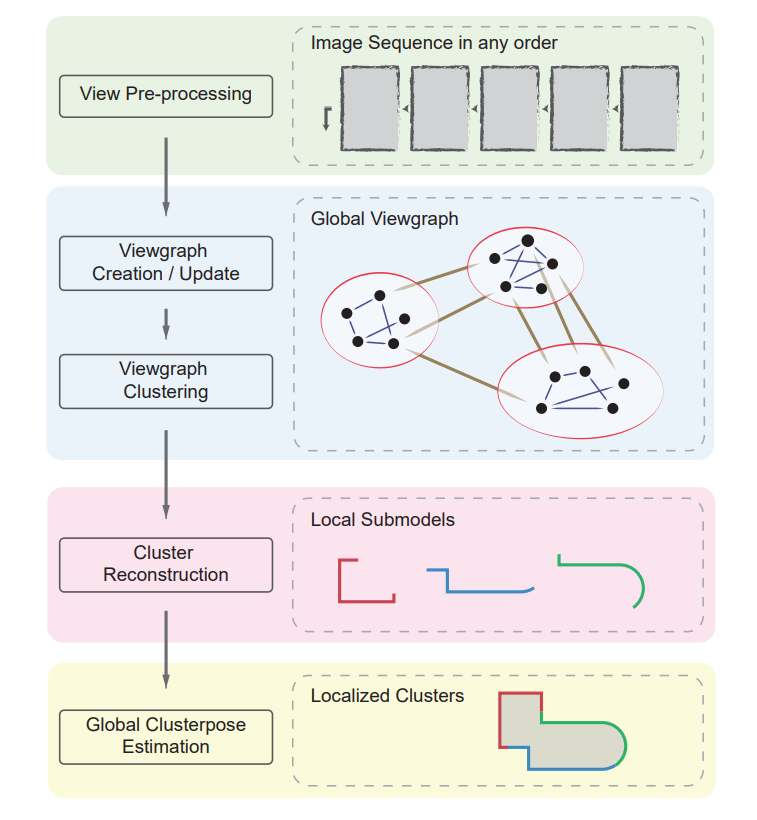

如下,分布式(大规模)三维重建的流程如下:
1. Feature Extraction.
2. Images Matching and View Graph Creation.
3. View Graph Clustering.
4. Cluster Reconstruction(These part can be implemented distributed).
5. Fusion.

## 可能会用到的第三方库

#### Normalized cut
https://github.com/iromu/Graclus

http://www.cs.utexas.edu/users/dml/Software/README_Graclus

#### libvot
A C++11 multithread library for image retrieval http://hlzz.github.io/libvot

#### GraphSfM
https://github.com/AIBluefisher/GraphSfM

## 论文
#### Tianwei Shen

https://home.cse.ust.hk/~tshenaa/#code

#### Normalized Cuts and Image Segmentation
https://repository.upenn.edu/cgi/viewcontent.cgi?article=1101&context=cis_papers

http://www.shenlanxueyuan.com/open/course/18/lesson/14/live/replay/223/entry?refererUrl=http%3A//www.shenlanxueyuan.com/open/course/explore

https://www.cnblogs.com/fzl194/p/8855101.html

https://blog.csdn.net/zitian246/article/details/76218020

https://blog.csdn.net/juncoder/article/details/38894217

https://blog.csdn.net/Amy_H/article/details/1907699
